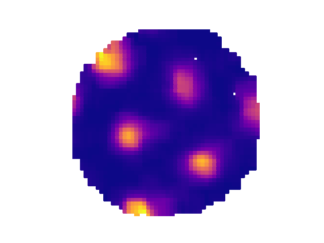
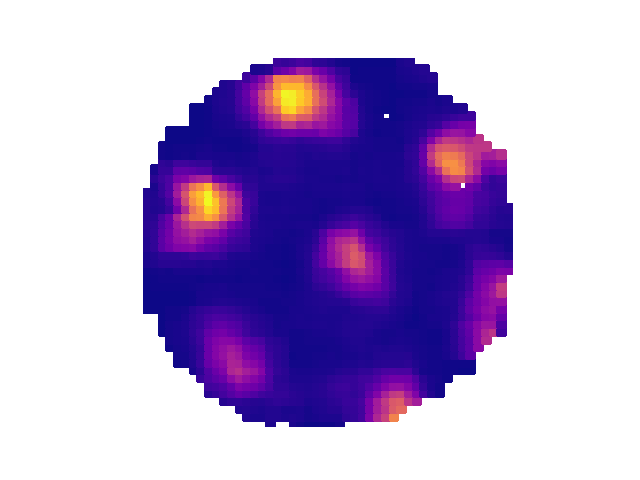

# Plotting functions

All of these plotting functions are part of a mixin class that is available
to OpenEphysBase and AxonaTrial via the base class TrialInterface.

Many of the plotting functions that are part of the FigureMaker class accept keyword
arguments that can modify the output. These include:

- separate_plots (bool) - if True and there is more than one cluster & channel given
                          to the method then each one will be plotted in a separate figure.
                          Default is False
- equal_axes (bool) - Make the axes equal or not. Default is True
- cmap (matplotlib.colormaps) - the colormap to use. Mostly this defaults to
                          matplotlib.colormaps['jet']
- ax - matplotlib.Axes instance. If provided the plot will be added to this axis

Some examples:

```python
from ephysiopy.io.recording import AxonaTrial
from pathlib import Path
import matplotlib.pylab as plt

data = Path("/path/to/data/M851_140908t2rh.set")

trial = AxonaTrial(data)
trial.load_pos_data()

trial.plot_rate_map([2,5],[3,3],separate_plots=True,cmap=matplotlib.colormaps['bone'])
plt.show()
```
{width='400px'}
{width='400px'}

::: ephysiopy.visualise.plotting.FigureMaker
    handler: python
    options:
      members:
        - plot_spike_path
        - plot_rate_map
        - plot_hd_map
        - plot_linear_rate_map
        - plot_eb_spikes
        - plot_eb_map
        - plot_acorr
        - plot_xcorr
        - plot_sac
        - plot_speed_v_hd
        - plot_raster
        - plot_speed_v_rate
        - plot_power_spectrum
        - plot_theta_vs_running_speed
        - plot_clusters_theta_phase
        - plot_waveforms
        - plotSpectrogramByDepth

