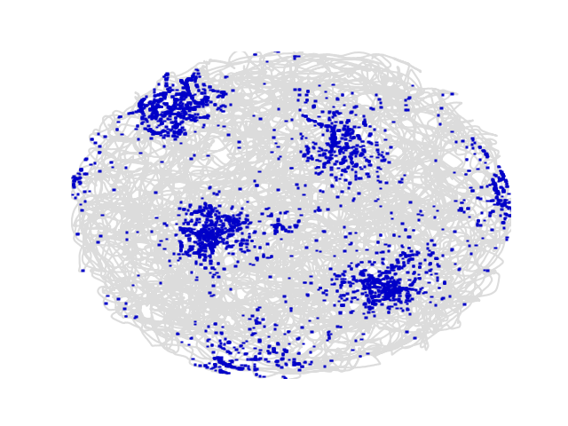

# Further usage

First, load some data:

```python
from ephysiopy.io.recording import AxonaTrial
from pathlib import Path

data = Path("/path/to/data/M851_140908t2rh.set")

trial = AxonaTrial(data)
```

## Trial settings

At this point the only data that has been loaded is the settings data. For
Axona data this consists of the key - value pairs in the .set file, essentially the 
state machine of the recording. Because of it's simple structure this is stored
as a standard python dictionary

```python
type(trial.settings)
dict
```

Because of the more flexible/ complex design of the OpenEphys plugin-GUI this
settings data is stored as it's own class:

```python
from ephysiopy.io.recording import OpenEphysBase

data = Path("/path/to/data/RHA1-00064_2023-07-07_10-47-31")

trial = OpenEphysBase(data)

type(trial.settings)
ephysiopy.openephys2py.OESettings.Settings
```

See [OEPlugins](./oe_settings.md#openephys-plugins) for more details

You won't need to interact with the settings directly for most if not all analyses; the
relevant bits are extracted and used in loading/ processing of other data.

## Position data

Regardless of the data source, position data is stored in the PosCalcsGeneric class:

```python
trial.load_pos_data()
Loaded pos data

type(trial.PosCalcs)
ephysiopy.common.ephys_generic.PosCalcsGeneric
```

There are several arguments you can add to the [load_pos_data](./io.md#ephysiopy.io.recording.OpenEphysBase.load_pos_data) function to control how
the position data is treated. An important one is 'ppm' which stads for pixels_per_metre.
It specifies how many pixels in camera units correspond to one metre. This is something you should measure
experimentally and record somewhere. The number is used to convert the position data to
real world units. If you don't specify it, the ppm value will take a default value of 300 (CHECK)

```python
trial.load_pos_data(ppm=800)
Loaded pos data
```

Other important arguments are jumpmax and cm. Jumpmax is the maximum distance that the animal can move between two frames.
If the distance between two frames is greater than this value, the position data for that frame will be interpolated over.
This is useful for removing artefacts in the position data caused by tracking errors.
The default value is 100 pixels. 'cm' is a boolean that specifies whether the position data should be converted to centimetres. The default value is False, which means that the position data will be in metres.

Once loaded the PosCalcs attribute has several attributes itself like 'xy' and 'dir' which are the x and y position and the head direction.

You shouldn't need to interact with the PosCalcs class directly for most analyses, but it's there if you need it.

The position data is used in several of the plotting functions and in the rate map calculations.

```python
import matplotlib.pylab as plt

trial.plot_spike_path()
plt.show()
```

{width='400px'}

## Spiking data

We can get the spike times in seconds at which a cluster fired:

```python title="Spike times for cluster 2 on channel 3"
trial.get_spike_times(2, 3)
masked_array(data=[0.7710416666666666, 4.6870416666666666,
                   4.693291666666667, ..., 2394.8471458333333,
                   2394.8537291666667, 2394.860708333333],
             mask=[False, False, False, ..., False, False, False],
       fill_value=1e+20)
```

!!! note

    The spike times are returned as a masked numpy array. It is possible
    to filter a trial for various things like speed, time, position etc.
    Many of the arrays returned from functions like this are masked to 
    reflect such filtering i.e. spikes that occurred when the animal ran
    below a speed threshold will be masked (mask value will be True)


You can plot the position at which spikes were emitted for a specific cluster on
top of the path:

```python title="Cluster 2 on channel 3"
trial.plot_spike_path(2, 3)
plt.show()
```

{width='400px', height='400px'}

And the corresponding rate map:

```python title="Rate map for cluster 2 on channel 3"
trial.plot_rate_map(2, 3)
plt.show()
```

{width='400px', height='400px'}

You can access the underlying data for the rate map as well:

```python title="Rate map data for cluster 2 on channel 3"
trial.get_rate_map(2, 3)

BinnedData(variable=<VariableToBin.XY: 1>, map_type=<MapType.RATE: 1>, binned_data=[masked_array(
...
```

Read more about the BinnedData class in the API docs [BinnedData](./utils.md#ephysiopy.common.utils.BinnedData) class
and a more verbose description [here](./ephysiopy_tutorial.md#the-underlying-data)

## Local field potential (LFP) data

Load the LFP data like so:

```python
trial.load_lfp()
```

This can take a while especially if the trial is long and recorded using OpenEphys
as the raw data has to be bandpass filtered first. Once that's done the
data is available as an [EEGCalcs](./lfp.md) attribute of the trial object

The default sampling rate for the LFP data is 250 Hz, but this can be changed by specifying the 'resample' argument in the load_lfp() function. For example, to resample the LFP data to 500 Hz:

```python
trial.load_lfp(target_sample_rate=500)
```

Target sample rates should not exceed the Nyquist frequency of the original data, which is half the original sampling rate. For example, if the original sampling rate is 1000 Hz, the target sample rate should not exceed 500 Hz. 

Once the data has been loaded you can then bandpass filter it using [butterFilter](./lfp.md#ephysiopy.common.ephys_generic.EEGCalcsGeneric.butterFilter) function:

```python title="Bandpass filter the LFP data between 6 and 12 Hz"
trial.LFP.butterFilter(6, 12)
```

## Filtering a trial

There is an [apply_filter()](./io.md#ephysiopy.io.recording.TrialInterface.apply_filter) method of the trial object that takes a list of
TrialFilter and applies those filters to the underlying data of the trial.

Specify a TrialFilter like so:

```python title="Filter for speed"
from ephysiopy.common.utils import TrialFilter

speed_filter = TrialFilter("speed", 0, 5)
trial.apply_filter([speed_filter])
```

This will filter out all data points where the animal's speed was below 5 cm/s. The filter is applied to all relevant data, so for example the spike times will be masked for all spikes that occurred when the animal was below the speed threshold.

You can build up a list of filters and apply them all at once:

```python title="Filter for speed and time"
speed_filter = TrialFilter("speed", 0, 5)
time_filter = TrialFilter("time", 100, 200)
trial.apply_filter([speed_filter, time_filter])
```

The trial has now been filtered for all data points where the animal's speed was below 5 cm/s and where the time was between 100 and 200 seconds.
The spike times will be masked for all spikes that occurred when the animal was below the speed threshold or outside the specified time range.

To remove the filters just call the apply_filter() method with no arguments:

```python title="Remove all filters"
trial.apply_filter()
```

All of the TrialFilter objects take the same arguments: the name of the filter, the minimum value and the maximum value.
The name of the filter should be one of the following:

```
time
dir
speed
xrange
yrange
phi
```

